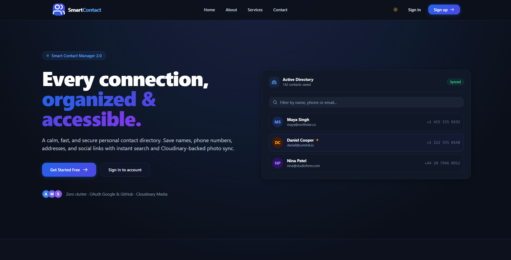
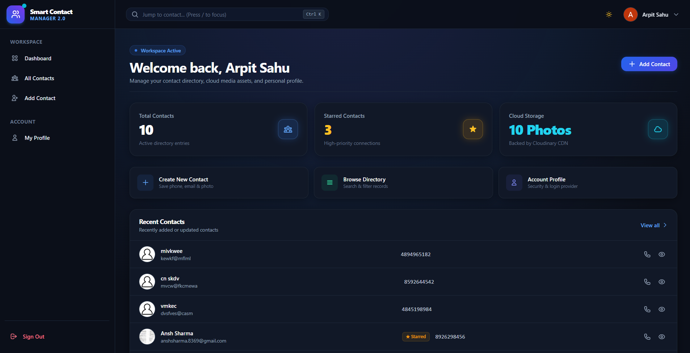
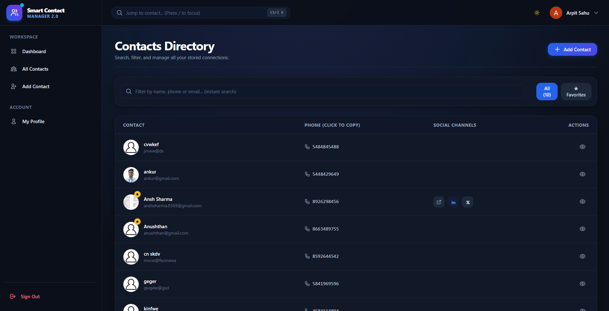
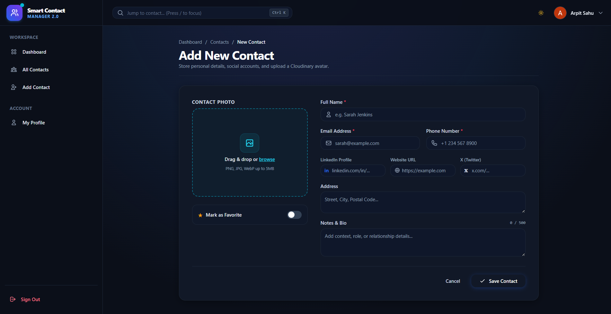
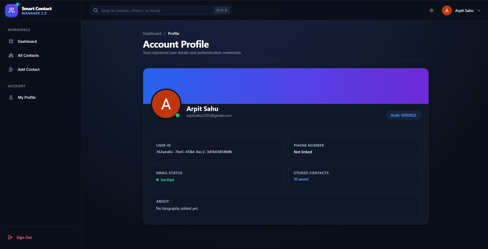
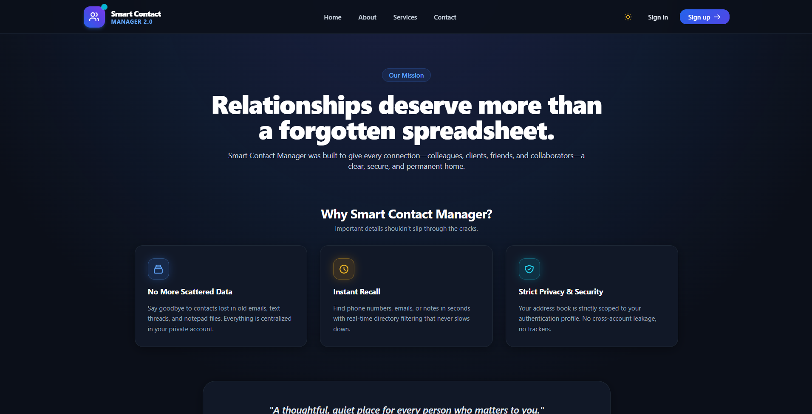

<div align="center">

# 📇 Smart Contact Manager

**A modern, secure, and high-performance contact directory application built with Spring Boot 4, Tailwind CSS, Cloudinary CDN, and Spring Security 6.**

[](https://openjdk.org/)
[](https://spring.io/projects/spring-boot)
[](https://spring.io/projects/spring-security)
[](https://tailwindcss.com/)
[](https://cloudinary.com/)
[](https://www.mysql.com/)

<br />

<p align="center">
  <a href="#-features">Features</a> •
  <a href="#-interface-showcase">Interface Showcase</a> •
  <a href="#-tech-stack">Tech Stack</a> •
  <a href="#-getting-started">Getting Started</a> •
  <a href="#-configuration">Configuration</a> •
  <a href="#-shortcuts">Keyboard Shortcuts</a>
</p>

</div>

---

## 🌟 Interface Showcase

<div align="center">

### 1. Landing Page & Product Hero
*Linear-inspired functional minimalism with high-contrast light and dark themes.*
<br/>


<br/><br/>

### 2. Workspace Dashboard
*Real-time metrics, animated counters, recent contacts overview, and quick action shortcuts.*
<br/>


<br/><br/>

### 3. Contacts Directory & Live Search
*High-density table with instant keyboard filtering (`Ctrl + K`), favorite filters, and one-click copy to clipboard.*
<br/>


<br/><br/>

### 4. Rich Contact Creator
*Drag-and-drop Cloudinary avatar dropzone, live image removal, and character counting.*
<br/>


<br/><br/>

### 5. Account Security & User Profile
*OAuth provider synchronization, verified email badges, and account metadata.*
<br/>


<br/><br/>

### 6. Philosophy & Mission
<br/>


</div>

---

## ✨ Features

### 🔐 Authentication & Security
- **Multi-Provider OAuth2**: One-click social authentication using **Google** and **GitHub**.
- **Standard Database Authentication**: Email and BCrypt-hashed password authentication with role-based access control (`ROLE_USER`).
- **CSRF & Session Protection**: Spring Security 6 session management with hardened CSRF tokens and safe redirect handlers.

### 📇 Contact Management & Cloud Media
- **Full CRUD Operations**: Create, view, update, and delete contacts with rich metadata (name, email, phone number, physical address, LinkedIn, Website, and X/Twitter links).
- **Cloudinary Image Synchronization**: Instant drag-and-drop photo uploads stored on Cloudinary's global media CDN.
- **Interactive Directory Table**:
  - Live client-side instant search filter with instant result count.
  - **One-Click Copy**: Click any phone number or email address to copy it to the clipboard with animated checkmark feedback and toast notification.
  - **Favorites Filter**: Quick tab toggle to filter high-priority starred contacts.
  - **Quick-View Modal**: Accessible modal popup for contact details with direct `tel:` and `mailto:` action triggers.

### 🎨 Modern UI & Interaction Design
- **Linear & Apple-Inspired Aesthetics**: Crisp slate typography, subtle borders, glassmorphic cards, and zero AI clutter.
- **Adaptive Dark & Light Mode**: Theme engine with system-preference detection and zero-flash inline script.
- **Tactile Micro-Interactions**: Animated stat counters on dashboard metrics, hover scale states, and interactive character countdown on notes.
- **Fully Responsive**: Fixed desktop sidebar navigation with mobile off-canvas drawer and backdrop blur overlay.

---

## 🛠 Tech Stack

| Layer | Technology | Description |
| :--- | :--- | :--- |
| **Backend** | Spring Boot 4.0.6 | Core web framework & dependency injection |
| **Language** | Java 21 LTS | Modern Java features (Records, Pattern Matching) |
| **Security** | Spring Security 6 & OAuth2 | Multi-provider authentication (Google, GitHub, Form) |
| **Persistence** | Spring Data JPA & Hibernate | Entity modeling and database abstractions |
| **Database** | MySQL 8.0+ | Relational storage for users and contacts |
| **Frontend** | Thymeleaf 3 | Server-side template engine |
| **Styling** | Tailwind CSS & Modern Theme | Utility-first CSS with dark/light mode tokens |
| **UI Add-ons** | Flowbite & Heroicons | Accessible modals, dropdowns, and vector icons |
| **Media CDN** | Cloudinary API | High-speed cloud image hosting & optimization |

---

## 📂 Project Structure

```
SCM-Smart-Contact-Manager/
├── docs/
│   └── screenshots/              # High-resolution application screenshots
├── src/
│   ├── main/
│   │   ├── java/org/arpitsahu/smc/
│   │   │   ├── config/           # Security, OAuth2, and App Configurations
│   │   │   ├── controllers/      # Spring MVC Routing (Page, User, Auth)
│   │   │   ├── entities/         # JPA Entities (User, Contact, SocialLink)
│   │   │   ├── forms/            # Form DTOs with validation rules
│   │   │   ├── helpers/          # Message handlers, Session helpers, Cloudinary
│   │   │   ├── repositories/     # Spring Data JPA Repositories
│   │   │   ├── services/         # Business Logic & User/Contact Services
│   │   │   └── SmcApplication.java # Application Entry Point
│   │   └── resources/
│   │       ├── static/
│   │       │   ├── css/          # Custom modern-theme.css & utility styles
│   │       │   ├── JS/           # Core Script.js & Admin.js preview engines
│   │       │   └── Images/       # Default avatar assets & SVG graphics
│   │       ├── templates/        # Thymeleaf Templates (home, login, register)
│   │       │   └── user/         # Authenticated User Views (dashboard, contacts)
│   │       └── application.properties # Main Spring configuration
├── .env.example                  # Template for local environment secrets
├── pom.xml                       # Maven dependencies & build configuration
└── README.md
```

---

## 🚀 Getting Started

### 1. Prerequisites
- **Java 21 LTS** or higher installed (`java -version`)
- **Maven 3.8+** (or use included `.\mvnw.cmd` / `./mvnw`)
- **MySQL Server 8.0+** running locally or remotely

### 2. Clone the Repository
```bash
git clone https://github.com/arpitsahu2203/SCM-Smart-Contact-Manager-.git
cd SCM-Smart-Contact-Manager-
```

### 3. Configure Environment Variables
Copy `.env.example` to `.env` (or set the properties directly in `src/main/resources/application.properties`):

```bash
cp .env.example .env
```

Fill in your local credentials:
```properties
# MySQL Configuration
DB_HOST=localhost
DB_PORT=3306
DB_NAME=scm2
DB_USER=root
DB_PASSWORD=your_mysql_password

# Cloudinary CDN Configuration
CLOUDINARY_CLOUD_NAME=your_cloud_name
CLOUDINARY_API_KEY=your_api_key
CLOUDINARY_API_SECRET=your_api_secret

# Google OAuth2 Credentials
GOOGLE_CLIENT_ID=your_google_client_id
GOOGLE_CLIENT_SECRET=your_google_client_secret

# GitHub OAuth2 Credentials
GITHUB_CLIENT_ID=your_github_client_id
GITHUB_CLIENT_SECRET=your_github_client_secret
```

### 4. Create MySQL Database
```sql
CREATE DATABASE scm2;
```

### 5. Build and Run
Using the included Maven wrapper:

**Windows (PowerShell):**
```powershell
.\mvnw.cmd clean spring-boot:run
```

**Linux / macOS:**
```bash
./mvnw clean spring-boot:run
```

The application will start on **`http://localhost:8080`**.

---

## ⌨️ Shortcuts & Micro-Interactions

| Shortcut / Action | Scope | Description |
| :--- | :--- | :--- |
| `Ctrl + K` or `/` | Global (Authenticated) | Focus and highlight the quick contact search input |
| `Click` on phone/email | Contacts Directory | Instantly copies text to clipboard with toast notification |
| `★ Favorites` Tab | Contacts Directory | Filters visible table rows down to starred connections |
| `Esc` | Quick-View Modal | Closes active contact profile dialog |
| `Sun / Moon` Icon | Top Navigation | Toggles between Dark Mode and Light Mode |

---

## 📄 License

This project is licensed under the [MIT License](LICENSE).
