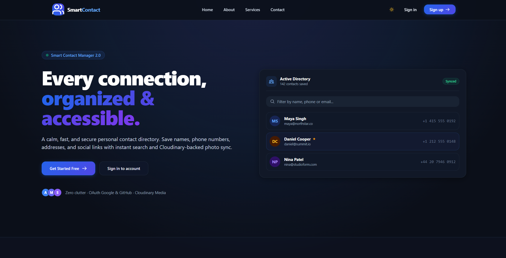
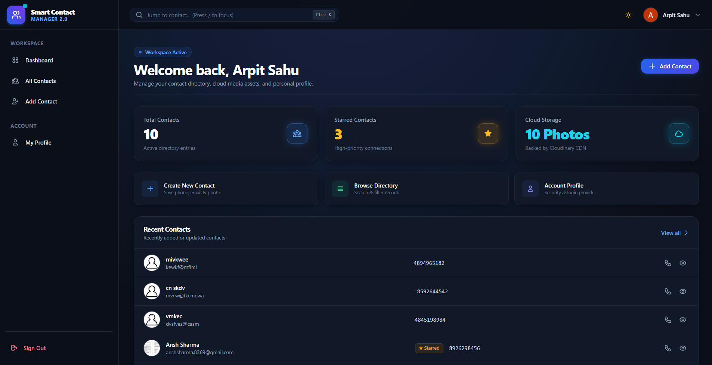
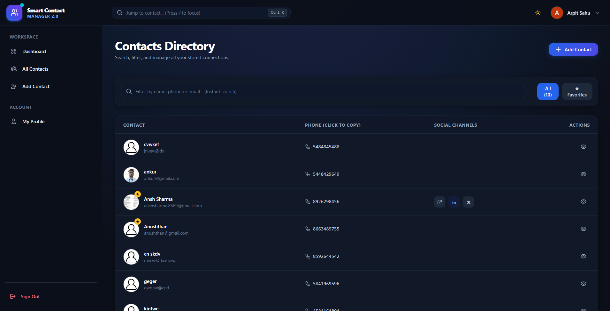
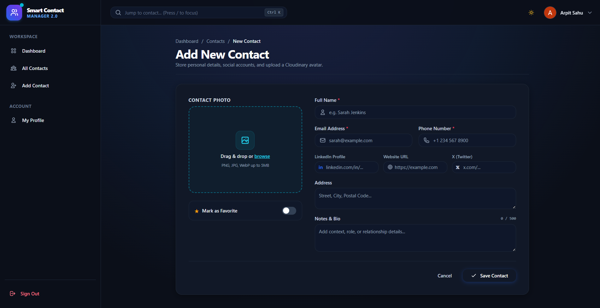
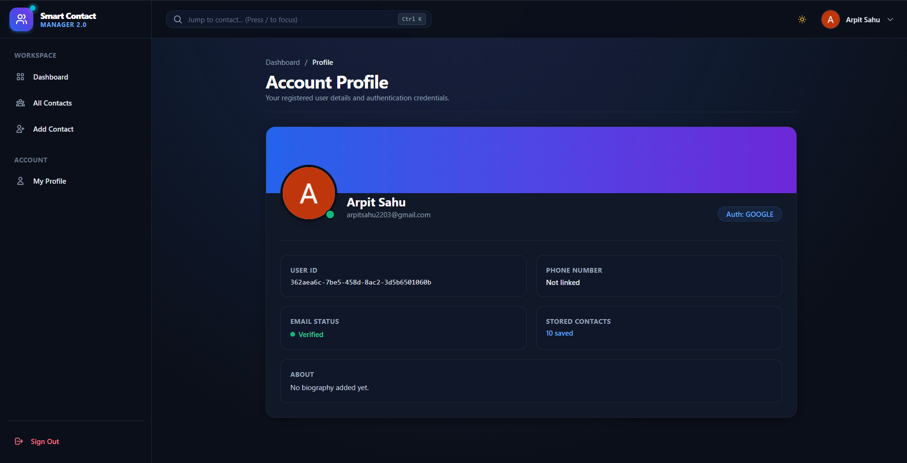
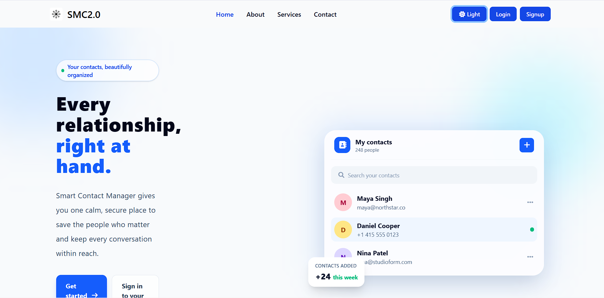

<div align="center">

# 📇 Smart Contact Manager (SMC)

**A modern, secure, and high-performance contact directory application built with Spring Boot 4, Tailwind CSS, Cloudinary CDN, and Spring Security 6.**

[](https://openjdk.org/)
[](https://spring.io/projects/spring-boot)
[](https://spring.io/projects/spring-security)
[](https://tailwindcss.com/)
[](https://cloudinary.com/)
[](https://www.mysql.com/)

<br />

<p align="center">
  <a href="#-features">Features</a> •
  <a href="#-rest-api-endpoints">REST API</a> •
  <a href="#-tech-stack">Tech Stack</a> •
  <a href="#-project-structure">Project Structure</a> •
  <a href="#-getting-started">Getting Started</a> •
  <a href="#-configuration">Configuration</a>
</p>

</div>

---

## 🌟 Interface Showcase

<div align="center">

### 1. Landing Page & Product Hero
*Linear-inspired functional minimalism with high-contrast light and dark themes.*
<br/>


<br/><br/>

### 2. Workspace Dashboard
*Real-time metrics, animated counters, recent contacts overview, and quick action shortcuts.*
<br/>


<br/><br/>

### 3. Contacts Directory & Live Search
*High-density table with instant keyboard filtering (`Ctrl + K`), favorite filters, one-click copy to clipboard, and quick-action triggers.*
<br/>


<br/><br/>

### 4. Rich Contact Creator
*Drag-and-drop Cloudinary avatar dropzone, live image removal, and character counting.*
<br/>


<br/><br/>

### 5. Account Security & User Profile
*OAuth provider synchronization, verified email badges, and editable account profile.*
<br/>


<br/><br/>

### 6. Philosophy & Mission
<br/>


</div>

---

## ✨ Features

### 🔐 Authentication & Security
- **Multi-Provider OAuth2**: One-click social authentication using **Google** and **GitHub**.
- **Database Authentication**: Email and BCrypt-hashed password authentication with role-based access control (`ROLE_USER`).
- **Granular Authorization**: Strict ownership validation preventing unauthorized access or deletion of other users' contacts.
- **Protected REST Layer**: Endpoints under `/SMC/user/**` and `/SMC/api/**` strictly enforce Spring Security authentication.

### 📇 Modern Contact Management
- **Full CRUD Engine**: Add, view, edit, and delete contacts with comprehensive profiles (Name, Email, Phone, Address, Notes, Favorite status, and Social Channels: LinkedIn, Website, X/Twitter, Instagram).
- **Asynchronous Contact Quick-View Modal (AJAX)**:
  - Zero-page-reload contact inspection powered by `GET /SMC/api/contacts/{id}`.
  - Smooth animation with an animated skeleton loader (`animate-pulse`) while fetching.
  - Dedicated error and offline fallback states.
  - Quick action buttons: **Direct Call** (`tel:`), **Send Email** (`mailto:`), **Edit Contact**, and **Delete Contact**.
- **Contact Deletion with Confirmation Popup**:
  - Accessible confirmation modal (`#delete-contact-confirm-modal`) displaying contact name and destruction warnings.
  - Destructive action executed asynchronously via `DELETE /SMC/api/contacts/{id}`.
  - Instant row removal with smooth CSS fade/scale transition and dynamic counter updates without reloading.
- **Contact Profile Editing**:
  - Full edit interface (`/SMC/user/Contact/view/{id}` & `/update/{id}`) with prefilled fields.
  - Supports photo replacement with Cloudinary upload synchronization.
- **User Account Profile Editing**:
  - Interactive profile edit modal on `/SMC/user/profile` allowing users to update their **Name**, **Phone Number**, and **About Bio**.
- **Interactive Directory Tools**:
  - Real-time client-side search filtering by name, phone, or email.
  - **One-Click Copy**: Click any phone number or email to copy to clipboard with instant visual feedback and toast notifications.
  - **Favorites Filtering**: Filter starred priority connections with one click.

### 🎨 Modern UI & Interaction Design
- **Linear & Apple-Inspired Aesthetics**: Crisp slate typography, subtle borders, glassmorphic panels, and glowing avatar halos.
- **Adaptive Dark & Light Mode**: Theme engine with system-preference detection and zero-flash inline script.
- **Tactile Micro-Interactions**: Animated stat counters on dashboard metrics, hover scale states, and interactive character countdown on notes.
- **Fully Responsive**: Fixed desktop sidebar navigation with mobile off-canvas drawer and backdrop blur overlay.

---

## 🔌 REST API Endpoints

All REST endpoints require authentication and enforce contact ownership:

| HTTP Method | Endpoint | Description | Status Codes |
| :--- | :--- | :--- | :--- |
| `GET` | `/SMC/api/contacts/{id}` | Fetches full contact details asynchronously | `200`, `401`, `403`, `404` |
| `PUT` | `/SMC/api/contacts/{id}` | Updates contact fields via JSON payload | `200`, `401`, `403`, `404` |
| `DELETE` | `/SMC/api/contacts/{id}` | Deletes a contact record with confirmation | `200`, `401`, `403`, `404` |

### Web Controller Routes

| HTTP Method | Route | Description |
| :--- | :--- | :--- |
| `GET` | `/SMC/user/Contact/view` | Contacts directory table with pagination and search |
| `GET` | `/SMC/user/Contact/add` | Add new contact view |
| `POST` | `/SMC/user/Contact/add` | Form submit to create a new contact |
| `GET` | `/SMC/user/Contact/view/{id}` | Edit contact profile page |
| `POST` | `/SMC/user/Contact/update/{id}` | Form submit to update contact details |
| `GET` | `/SMC/user/Contact/delete/{id}` | Traditional fallback delete route |
| `GET` | `/SMC/user/profile` | View logged-in user profile |
| `POST` | `/SMC/user/profile/update` | Update user account name, phone, and bio |

---

## 🛠 Tech Stack

| Layer | Technology | Description |
| :--- | :--- | :--- |
| **Backend Framework** | Spring Boot 4.0.6 | Core web framework, REST controllers, and dependency injection |
| **Language** | Java 21 LTS | Modern Java features (Records, Pattern Matching) |
| **Security** | Spring Security 6 & OAuth2 | Multi-provider authentication (Google, GitHub, Form Login) |
| **Persistence** | Spring Data JPA & Hibernate | Entity modeling and database abstractions |
| **Database** | MySQL 8.0+ | Relational storage for users, contacts, and tokens |
| **Frontend** | Thymeleaf 3 | Server-side template engine |
| **Styling** | Tailwind CSS & Modern Theme | Utility-first CSS with dark/light mode tokens |
| **Interactions** | Vanilla JavaScript (ES6+) | Asynchronous AJAX fetch, modal engines, and clipboard integration |
| **Media CDN** | Cloudinary API | High-speed cloud image hosting & optimization |

---

## 📂 Project Structure

```
SCM-Smart-Contact-Manager/
├── docs/
│   └── screenshots/              # High-resolution application screenshots
├── src/
│   ├── main/
│   │   ├── java/org/arpitsahu/smc/
│   │   │   ├── Config/           # SecurityConfig, OAuth2SuccessHandler, AppConfig
│   │   │   ├── Controller/       # ContactController, ContactApiController, UserController
│   │   │   ├── Entities/         # JPA Entities (Users, Contact, Providers, SocialLink)
│   │   │   ├── forms/            # Form DTOs (contactForm, UserForms)
│   │   │   ├── Helper/           # Helpers, AppConstants, ResourceNotFoundException
│   │   │   ├── payload/          # ContactResponseDto (Clean REST serialization)
│   │   │   ├── Repository/       # Spring Data JPA Repositories (UserRepo, contactRepo)
│   │   │   ├── Services/         # Service Interfaces (contactService, UserService)
│   │   │   ├── ServiceImpl/      # Service Implementations (contactServiceImpl, etc.)
│   │   │   └── SmcApplication.java # Application Entry Point
│   │   └── resources/
│   │       ├── static/
│   │       │   ├── css/          # Custom modern-theme.css & utility styles
│   │       │   ├── JS/           # Script.js (Modal & AJAX engines) & Admin.js
│   │       │   └── Images/       # Default avatar assets & SVG graphics
│   │       ├── templates/        # Thymeleaf Templates (Base, home, login, register)
│   │       │   └── user/         # Authenticated User Views (dashboard, contacts, UpdateContact, profile)
│   │       └── application.properties # Main Spring configuration
├── .env.example                  # Template for local environment secrets
├── pom.xml                       # Maven dependencies & build configuration
└── README.md
```

---

## 🚀 Getting Started

### 1. Prerequisites
- **Java 21 LTS** or higher installed (`java -version`)
- **Maven 3.8+** (or use included `.\mvnw.cmd` / `./mvnw`)
- **MySQL Server 8.0+** running locally or remotely

### 2. Clone the Repository
```bash
git clone https://github.com/arpitsahu2203/SCM-Smart-Contact-Manager-.git
cd SCM-Smart-Contact-Manager-
```

### 3. Configure Environment Variables
Copy `.env.example` to `.env`:

```bash
cp .env.example .env
```

Fill in your local credentials:
```properties
# MySQL Configuration
DB_HOST=localhost
DB_PORT=3306
DB_NAME=scm2
DB_USER=root
DB_PASSWORD=your_mysql_password

# Cloudinary CDN Configuration
CLOUDINARY_CLOUD_NAME=your_cloud_name
CLOUDINARY_API_KEY=your_api_key
CLOUDINARY_API_SECRET=your_api_secret

# Google OAuth2 Credentials
GOOGLE_CLIENT_ID=your_google_client_id
GOOGLE_CLIENT_SECRET=your_google_client_secret

# GitHub OAuth2 Credentials
GITHUB_CLIENT_ID=your_github_client_id
GITHUB_CLIENT_SECRET=your_github_client_secret
```

### 4. Create MySQL Database
```sql
CREATE DATABASE scm2;
```

### 5. Build and Run
Using the included Maven wrapper:

**Windows (PowerShell):**
```powershell
.\mvnw.cmd clean spring-boot:run
```

**Linux / macOS:**
```bash
<<<<<<< HEAD
./mvnw clean spring-boot:run
```

Access the application in your browser at `http://localhost:8080`.

---
=======
mvn clean package
```   
>>>>>>> 0f40a82c5526d86f81e3f6db2af5f99222c295b2

## ⌨️ Keyboard Shortcuts

| Shortcut | Action | Scope |
| :--- | :--- | :--- |
| `Ctrl + K` or `/` | Focus live contact search bar | Contacts Directory |
| `Escape` | Close active modals (Profile, Delete Confirmation) | Global |

---

## 📄 License
This project is licensed under the MIT License.
